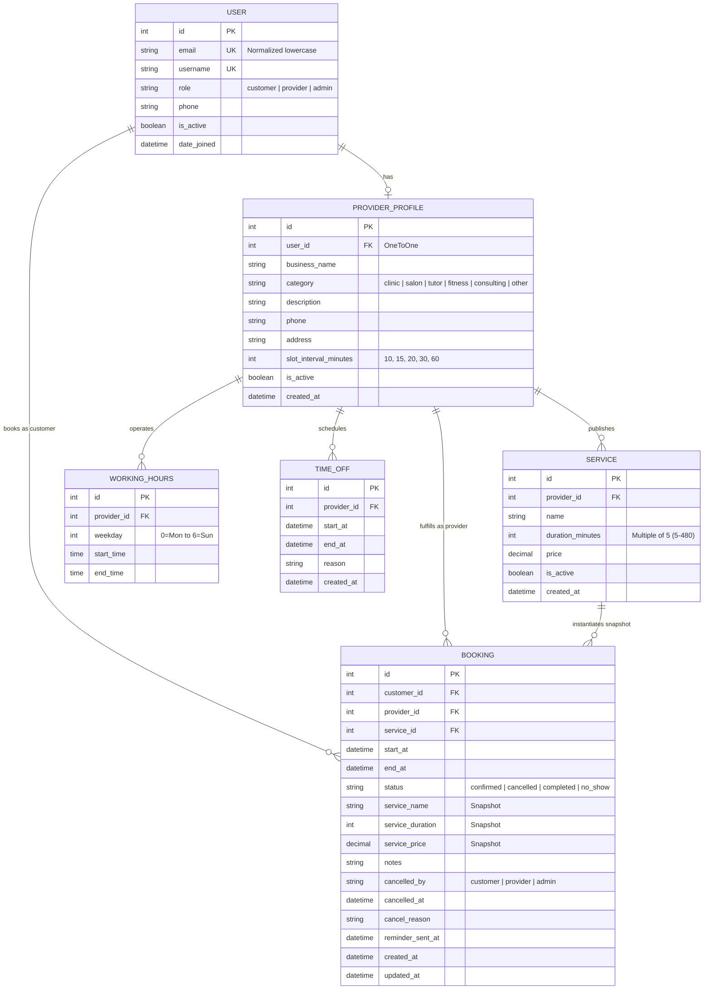

# SlotSync — Multi-Service Appointment & Dynamic Slot Booking Platform

> **Portfolio Project 3 (Final Full-Stack Capstone)**  
> Built with **Django 5 REST Framework**, **React 18 (Vite)**, **MySQL 8.0**, and **Tailwind CSS**.  
> Engineered with genuine business logic: on-demand dynamic slot generation, pessimistic row locking (`SELECT ... FOR UPDATE`), cancellation/rescheduling cutoff rules, RFC 5545 `.ics` downloads, and 3-tier Role-Based Access Control (RBAC).

---

## 1. Overview & Core Engineering Highlights

SlotSync is a multi-tenant service booking platform designed for real-world businesses (dental clinics, styling salons, music tutors, and consultants). Unlike simple CRUD apps, SlotSync solves complex temporal coordination challenges:

- **Dynamic In-Memory Slot Generation:** Instead of pre-generating millions of "empty slot" rows in the database, available slots are calculated dynamically on request in memory using at most **2 bounded queries per day or month**.
- **Pessimistic Locking Hierarchy (Deadlock-Free):** Prevents double-booking race conditions during high-concurrency booking attempts using strict uniform locking order: `Customer` &rarr; `ProviderProfile` &rarr; `Booking`.
- **Customer Self-Overlap Guard:** Prevents a single customer from booking conflicting appointments with two different providers simultaneously.
- **Strict Business Policy Enforcement:**
  - Minimum notice window: 2 hours advance booking required (`MIN_NOTICE_HOURS = 2`).
  - Maximum scheduling advance: 60 days (`MAX_ADVANCE_DAYS = 60`).
  - Strict cancellation / reschedule cutoff: strictly **more than 4 hours** before appointment start (`CANCEL_CUTOFF_HOURS = 4`).
- **Snapshot Architecture:** Captures permanent snapshots of `service_name`, `service_duration`, and `service_price` at booking creation time so future price changes or duration adjustments never alter past bookings or rescheduling terms.
- **RFC 5545 iCalendar Feeds (`.ics`):** Dynamically generated calendar invite files using CRLF (`\r\n`) line terminators, UTC Zulu formatting, and deterministic UIDs for native integration with Apple Calendar, Google Calendar, and Microsoft Outlook.
- **Automated Reminder Engine:** Idempotent Django management command (`send_reminders`) designed for cron automation.

---

## 2. Interactive Demo Accounts

SlotSync comes pre-seeded with realistic schedules, active services, past completed appointments, and upcoming bookings.

| Role | Email | Password | Persona / Business |
| :--- | :--- | :--- | :--- |
| **Administrator** | `admin@slotsync.local` | `AdminPass123!` | Platform Admin (Full platform governance) |
| **Provider (Clinic)** | `aisha.sharma@slotsync.local` | `DemoPass123!` | Dr. Aisha Sharma — Apex Dental Care (Clinic) |
| **Provider (Salon)** | `marcus.vance@slotsync.local` | `DemoPass123!` | Marcus Vance — Urban Edge Salon (Salon & Spa) |
| **Provider (Tutor)** | `elena.rostova@slotsync.local` | `DemoPass123!` | Elena Rostova — Master Piano Studio (Tutor) |
| **Customer** | `rahul.verma@example.com` | `DemoPass123!` | Rahul Verma (Patient / Client) |
| **Customer** | `priya.nair@example.com` | `DemoPass123!` | Priya Nair (Client) |

> **Tip:** When `VITE_DEMO_MODE=true`, a top sandbox banner provides **1-click persona switching** for effortless evaluation.

---

## 3. Database Architecture & ER Diagram



---

## 4. Role-Based Access Control (RBAC) Matrix

| Feature / Resource | Public Guest | Customer | Provider | Administrator |
| :--- | :---: | :---: | :---: | :---: |
| Browse Active Providers & Services |  |  |  |  |
| Inspect Dynamic Live Slots |  |  |  |  |
| Book Appointment | ❌ |  | ❌ | ❌ |
| View Own Bookings | ❌ |  (Scoped) |  (Scoped) |  (All) |
| Cancel Appointment (> 4h cutoff) | ❌ |  | ❌ | ❌ |
| Cancel Appointment (Anytime before start) | ❌ | ❌ |  |  |
| Reschedule Appointment (> 4h cutoff) | ❌ |  | ❌ | ❌ |
| Mark Complete / No-Show (After start) | ❌ | ❌ |  |  |
| Download RFC 5545 `.ics` Calendar File | ❌ |  |  |  |
| Manage Services & Working Schedules | ❌ | ❌ |  | ❌ |
| Schedule Provider Time-Off | ❌ | ❌ |  | ❌ |
| Platform User Governance & Onboarding | ❌ | ❌ | ❌ |  |
| View Platform Volume & Revenue Stats | ❌ | ❌ |  (Self) |  (Global) |

---

## 5. API Endpoints Reference

### Authentication & Users (`/api/auth/` & `/api/users/`)
- `POST /api/auth/register/`: Register public customer account.
- `POST /api/auth/login/`: Obtain JWT pair with email & password.
- `POST /api/auth/token/refresh/`: Refresh expired access token.
- `GET /api/auth/me/`: Retrieve current authenticated profile.
- `GET /api/users/`: List users (admin only, filterable by role).
- `PATCH /api/users/{id}/`: Update user active status (admin only; safeguards self and last admin).

### Providers & Directory (`/api/providers/`)
- `GET /api/providers/`: Public directory of active businesses with services.
- `GET /api/providers/{id}/`: Detailed provider profile with schedules.
- `GET /api/providers/{id}/availability/`: Dynamic slots for a provider on `?date=YYYY-MM-DD&service={id}`.
- `GET /api/providers/{id}/availability/days/`: Calendar active days for `?month=YYYY-MM&service={id}`.

### Provider Self-Management (`/api/provider/`)
- `GET, POST /api/provider/services/`: Manage service offerings.
- `PATCH, DELETE /api/provider/services/{id}/`: Update or soft-delete service.
- `GET, POST /api/provider/working-hours/`: Manage multi-interval weekly working schedule.
- `DELETE /api/provider/working-hours/{id}/`: Remove schedule interval.
- `GET, POST, DELETE /api/provider/time-off/`: Schedule leaves with booking clash prevention.

### Bookings & Lifecycle (`/api/bookings/`)
- `POST /api/bookings/`: Book appointment with pessimistic row locking.
- `GET /api/bookings/`: Scoped appointment list (Customer sees own, Provider sees theirs, Admin sees all).
- `GET /api/bookings/{id}/`: Scoped booking detail (unauthorized yields 404).
- `GET /api/bookings/{id}/ics/`: Download RFC 5545 `.ics` calendar file.
- `POST /api/bookings/{id}/cancel/`: Cancel booking (`reason` in payload).
- `POST /api/bookings/{id}/reschedule/`: Reschedule booking (`start_at` in payload).
- `POST /api/bookings/{id}/complete/`: Mark appointment completed (Provider/Admin, after start).
- `POST /api/bookings/{id}/no-show/`: Mark appointment no-show (Provider/Admin, after start).
- `GET /api/dashboard/stats/`: Role-tailored operational metrics.

---

## 6. Local Setup & Installation

### Prerequisites
- Python 3.12+
- Node.js 18+ and npm
- MySQL Server 8.0 running locally

### 1. Database Provisioning (MySQL)
Run in your local MySQL client:
```sql
CREATE DATABASE booking_db CHARACTER SET utf8mb4 COLLATE utf8mb4_unicode_ci;
CREATE DATABASE test_booking_db CHARACTER SET utf8mb4 COLLATE utf8mb4_unicode_ci;
CREATE USER 'booking_user'@'127.0.0.1' IDENTIFIED BY 'YourLocalPassword';
GRANT ALL PRIVILEGES ON booking_db.* TO 'booking_user'@'127.0.0.1';
GRANT ALL PRIVILEGES ON test_booking_db.* TO 'booking_user'@'127.0.0.1';
FLUSH PRIVILEGES;
```

### 2. Backend Setup
```bash
cd backend
python -m venv venv
# On Windows:
.\venv\Scripts\activate
# On macOS/Linux:
source venv/bin/activate

pip install -r requirements.txt

# Create .env file with your database credentials:
# (Never commit .env to source control)
cat << 'EOF' > .env
SECRET_KEY=your-local-dev-secret-key-at-least-50-characters-long
DEBUG=True
ALLOWED_HOSTS=127.0.0.1,localhost
DB_ENGINE=mysql
DB_NAME=booking_db
DB_USER=booking_user
DB_PASSWORD=YourLocalPassword
DB_HOST=127.0.0.1
DB_PORT=3306
CORS_ALLOWED_ORIGINS=http://localhost:5173,http://127.0.0.1:5173
DEMO_MODE=True
EOF

python manage.py migrate
python manage.py seed_demo
python manage.py runserver
```

### 3. Frontend Setup
```bash
cd frontend
npm install
npm run dev
```
Open `http://localhost:5173` in your browser.

---

## 7. Automated Test Suite

SlotSync includes comprehensive unit, lifecycle, and multi-threaded concurrency tests running directly against MySQL:

```bash
cd backend
python manage.py test accounts.tests providers.tests bookings.tests
```

### Verification Matrix (41 Tests Passed)
- **Slot Generation & Availability (9 Tests):** Lunch breaks, multi-interval shifts, services longer than gaps, existing booking exclusion, back-to-back boundary verification, time-off blocking, exact 2-hour minimum notice boundary, 60-day maximum advance window, and month-level calendar query.
- **Booking Creation & Double Locking (5 Tests):** Pessimistic row locking, snapshot preservation (`service_name`, `price`, `duration`), role restrictions, inactive service/provider rejection.
- **Concurrency & Race Conditions (2 Tests):**
  - Two threads attempting to book the exact same slot concurrently &rarr; Exactly 1 succeeds, exactly 1 receives HTTP 409 Conflict.
  - One customer attempting to double-book across two different providers at the exact same hour &rarr; Serialized by customer row lock; exactly 1 succeeds, exactly 1 receives HTTP 409 Conflict.
- **Rescheduling & Snapshot Integrity (4 Tests):** Rescheduling to valid slots, own current slot non-conflict, taken slot rejection (409), preservation of booked duration snapshot when service length changes.
- **Cancellation Cutoff Policies (3 Tests):** Customer cancellation strictly > 4 hours ahead allowed, cancellation $\le 4$ hours rejected with HTTP 400, provider cancellation allowed until start time.
- **Attendance & Final State Immutability (3 Tests):** Cannot complete or mark no-show before start time, final state immutability, direct PUT/PATCH/DELETE blocked with HTTP 405.
- **Scoped Querysets & Security (2 Tests):** Customer cannot access or download other customers' bookings (HTTP 404).
- **ICS Generation, Reminders & Dashboards (4 Tests):** RFC 5545 CRLF compliance, `send_reminders` idempotency, role-specific metrics aggregation, and demo seeding.

---

## 8. Honest Cloud & Free-Tier Limitations

In transparency for technical interview discussions:
1. **Render Free-Tier Spin-Down:** Web services on Render's free tier sleep after 15 minutes of inactivity. The initial cold start takes approximately 45–50 seconds.
2. **Aiven MySQL Free Tier Connection Caps:** Free Aiven instances limit concurrent connections (~20 max). All multi-threaded test cases call `connection.close()` to avoid pool exhaustion.
3. **Cron Job Execution on Free Tier:** Automated reminder commands (`python manage.py send_reminders`) require an external trigger (e.g. cron-job.org or GitHub Actions workflow) when deployed on free hosting without continuous background workers.
